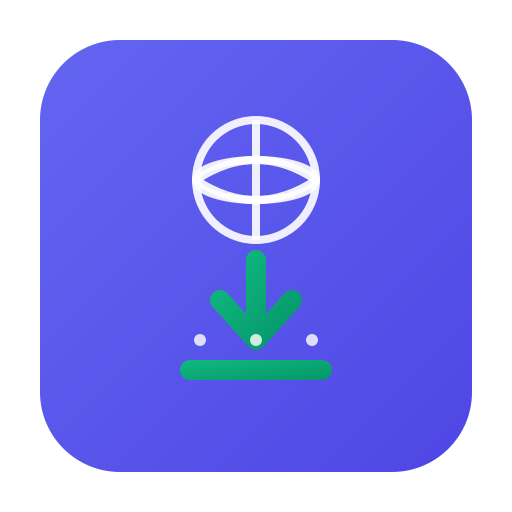

<div align="center">
  
  <h1>Internet Download Hub</h1>
  <p>A free, open source desktop video downloader for Windows</p>

  <a href="https://github.com/Isaac-Onyango-Dev/Internet-Download-Hub/releases/latest">
    
  </a>
  <a href="https://github.com/Isaac-Onyango-Dev/Internet-Download-Hub/releases/latest">
    
  </a>
  
  
</div>

---

## What is Internet Download Hub?

Internet Download Hub is a free Windows desktop application that lets you download videos from over 1000 websites including YouTube, Twitter, TikTok, Instagram, Facebook, Vimeo, Reddit, and many more. No browser extension required — just paste the video link and download.

## Features

- Download from 1000+ sites — YouTube, Twitter, TikTok, Instagram, Facebook, Reddit, Vimeo and more
- Multiple quality options — 1080p, 720p, 480p, 360p, Audio Only
- Fast parallel downloading with real-time progress tracking
- Automatic audio and video merging via FFmpeg
- Smart fallback engine system — yt-dlp, streamlink, N_m3u8DL-RE, Playwright
- Download queue with pause, resume, and cancel
- Download history
- Customizable save location
- No installation of Python or yt-dlp required — core binaries are bundled
- On-demand high-quality merging — FFmpeg is automatically downloaded on first use to keep the initial installer small (< 150MB)

## Download

**[Download the latest version for Windows](https://github.com/Isaac-Onyango-Dev/Internet-Download-Hub/releases/latest)**

Requirements: Windows 10 or Windows 11 (64-bit)

## Installation

1. Download `Internet Download Hub Setup 1.0.0.exe` from the link above
2. Double click the installer
3. Follow the installation steps
4. Open Internet Download Hub from your Start Menu or Desktop

## How to Use

1. Copy a video link from any supported website
2. Paste it into the URL field in the app
3. Click **Get Video Info**
4. Select your preferred quality
5. Click **Download**

## Building from Source

```cmd
git clone https://github.com/Isaac-Onyango-Dev/Internet-Download-Hub.git
cd Internet-Download-Hub
npm install
npm run dev
```

To build the Windows installer:
```cmd
npm run build:win
```

## Support

If you find this app useful please consider sharing it with others. Visit the [project website](https://isaac-onyango-dev.github.io/Internet-Download-Hub) to share or report issues.

## License

MIT License — see LICENSE for details.
