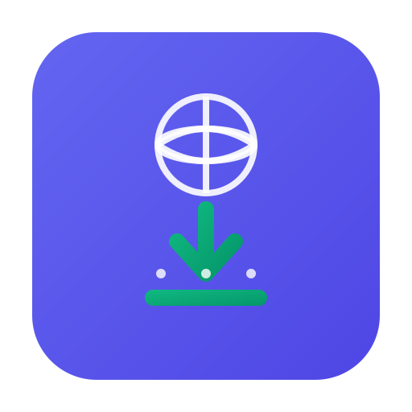
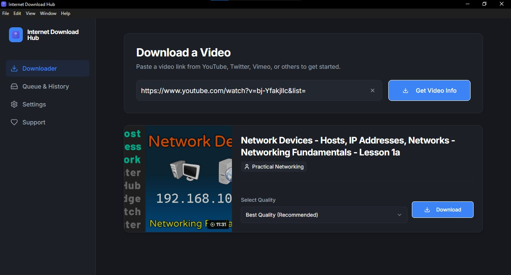
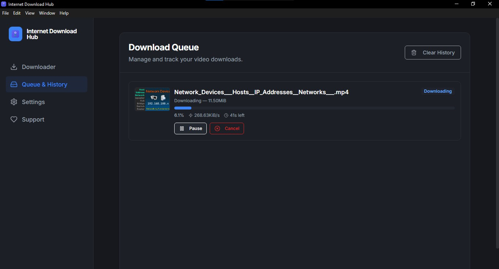
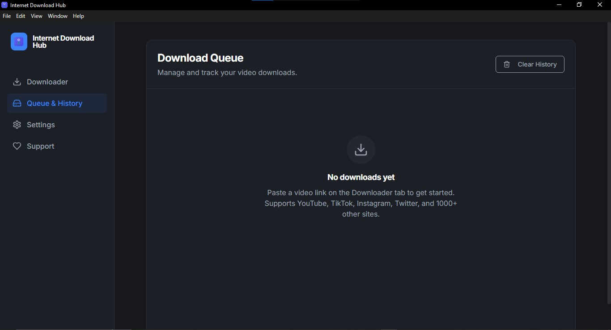
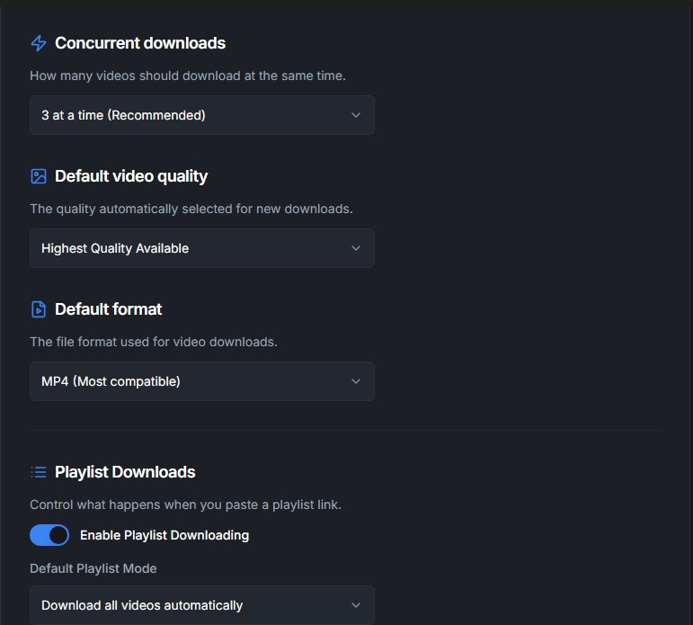

<div align="center">
  
  <h1>Internet Download Hub</h1>
  <p>A free, open source desktop video downloader for Windows</p>

  <!-- Build Status Badge - Add your CI badge here -->
  <!--  -->

  <a href="https://github.com/Isaac-Onyango-Dev/Internet-Download-Hub/releases/latest">
    
  </a>
  <a href="https://github.com/Isaac-Onyango-Dev/Internet-Download-Hub/releases/latest">
    
  </a>
  
  
</div>

---

## What is Internet Download Hub?

Internet Download Hub is a free Windows desktop application that lets you download videos from over 1000 websites including YouTube, Twitter, TikTok, Instagram, Facebook, Vimeo, Reddit, and many more. No browser extension required — just paste the video link and download.

## Web Version

A fully free web-based version of Internet Download Hub is available for quick downloads **without installation**.

- **Web App**: [internet-download-hub.onrender.com](https://internet-download-hub.onrender.com/)
- **No installation required** — works directly in your browser
- **Powered by Cobalt API** — supports YouTube, TikTok, Twitter, Instagram, and more
- **Fully static** — operates locally in your browser with zero backend requirements

**Web Version Limitations:**
- Uses Cobalt API (community instances)
- No persistent download history
- Basic quality selection
- Supported sites: YouTube, TikTok, Twitter, Instagram, Reddit, Vimeo, and 50+ other platforms
- For advanced features (playlists, scheduling, format conversion), use the **desktop version**

**Desktop Version Advantages:**
- All 1000+ sites supported by yt-dlp
- Download history and queue
- Playlist downloads with auto-naming
- Audio extraction and format conversion
- Parallel downloads with pause/resume
- Customizable output folder

## Tech Stack

| Component              | Technology                                                                                                                                                                    |
| ---------------------- | ----------------------------------------------------------------------------------------------------------------------------------------------------------------------------- |
| **Framework**          | [Electron](https://www.electronjs.org/)                                                                                                                                       |
| **Language**           | [TypeScript](https://www.typescriptlang.org/)                                                                                                                                 |
| **Build Tool**         | [Vite](https://vitejs.dev/)                                                                                                                                                   |
| **Styling**            | [Tailwind CSS](https://tailwindcss.com/)                                                                                                                                      |
| **Download Engines**   | [yt-dlp](https://github.com/yt-dlp/yt-dlp), [FFmpeg](https://ffmpeg.org/), [streamlink](https://streamlink.github.io/), [N_m3u8DL-RE](https://github.com/nilaoda/N_m3u8DL-RE) |
| **Browser Automation** | [Playwright](https://playwright.dev/)                                                                                                                                         |

## Supported Sites

Internet Download Hub supports downloading from **1000+ websites**, including:

| Category              | Sites                                                                                           |
| --------------------- | ----------------------------------------------------------------------------------------------- |
| **Video Platforms**   | YouTube, TikTok, Instagram, Twitter/X, Facebook, Reddit, Vimeo, Dailymotion, Bilibili, Odyspace |
| **Live Streaming**    | Twitch, Kick, Rumble, VK Live                                                                   |
| **Anime & Streaming** | Crunchyroll, Funimation, niconico                                                               |
| **Image Boards**      | Pixiv, DeviantArt, ArtStation, Flickr                                                           |
| **Social Media**      | Tumblr, Pinterest, Reddit                                                                       |
| **And many more...**  | 1000+ sites supported via yt-dlp                                                                |

## Screenshots

|                   Downloader                   |                Active Queue                 |                 Empty Queue                 |                  Settings                  |
| :--------------------------------------------: | :-----------------------------------------: | :-----------------------------------------: | :----------------------------------------: |
|  |  |  |  |

## Features

- Download from 1000+ sites — YouTube, Twitter, TikTok, Instagram, Facebook, Reddit, Vimeo and more
- Multiple quality options — 1080p, 720p, 480p, 360p, Audio Only
- Fast parallel downloading with real-time progress tracking
- Automatic audio and video merging via FFmpeg
- Smart fallback engine system — yt-dlp, streamlink, N_m3u8DL-RE, Playwright
- Download queue with pause, resume, and cancel
- Download history
- Customizable save location
- No installation of Python or yt-dlp required — core binaries are bundled
- On-demand high-quality merging — FFmpeg is automatically downloaded on first use to keep the initial installer small (< 150MB)

## Download

**[Download the latest version for Windows](https://github.com/Isaac-Onyango-Dev/Internet-Download-Hub/releases/latest)**

Requirements: Windows 10 or Windows 11 (64-bit)

## Installation

1. Download `Internet Download Hub Setup X.X.X.exe` from the link above
2. Double click the installer
3. Follow the installation steps
4. Open Internet Download Hub from your Start Menu or Desktop

## How to Use

1. Copy a video link from any supported website
2. Paste it into the URL field in the app
3. Click **Get Video Info**
4. Select your preferred quality
5. Click **Download**

## Roadmap

Planned features and improvements:

- [ ] **macOS support** — Native app for Mac users
- [ ] **Browser extension** — Quick capture from browser
- [ ] **Batch URL import** — Download multiple videos at once from a list
- [ ] **Dark/Light theme toggle** — Theme customization option
- [ ] **Scheduled downloads** — Queue downloads for later
- [ ] **Download history search** — Find past downloads easily
- [ ] **Custom output templates** — Advanced filename customization

## FAQ

### Why does FFmpeg download on first use?

FFmpeg is a large library (~80MB) used to merge separate video and audio tracks into a single file. To keep the initial installer small (< 150MB), FFmpeg is downloaded automatically the first time you need it for high-quality video merging. This only happens once.

### Do I need Python installed?

No! Unlike other yt-dlp-based tools, Internet Download Hub bundles all required binaries (yt-dlp, FFmpeg, streamlink, etc.) directly with the app. You don't need to install Python or any other dependencies.

### Which video quality should I choose?

For the best quality, select **Highest Quality Available**. The app will automatically download the best video and audio tracks and merge them. For smaller files, choose 720p or 480p.

### How do I download age-restricted videos?

Some videos on YouTube and other sites require you to be signed in. In Settings, you can import your browser cookies (Netscape format) to access these videos. See the Settings page in the app for instructions.

### Is this app safe to use?

Internet Download Hub is open source under the MIT license. You can review the source code on GitHub. The app only downloads content that is publicly available or accessible with your own account credentials.

## Building from Source

```cmd
git clone https://github.com/Isaac-Onyango-Dev/Internet-Download-Hub.git
cd Internet-Download-Hub
npm install
npm run dev
```

To build the Windows installer:

```cmd
npm run build:win
```

## Contributing

Contributions are welcome! Please see [CONTRIBUTING.md](./CONTRIBUTING.md) for guidelines on how to contribute.

## Support

If you find this app useful please consider sharing it with others. Visit the [project website](https://internet-download-hub.onrender.com) to share or report issues.

## End-user agreement (EULA)

**Internet Download Hub is intended for adults only** (18+, or the age of majority where you live, whichever is greater). By installing or using the app you agree to the [EULA.txt](./EULA.txt). The Windows installer shows this text before installation.

## License

The **source code** is licensed under the MIT License — see [LICENSE](./LICENSE) for details. The EULA governs **use** of the distributed application; the MIT license governs the **software** as a project.
